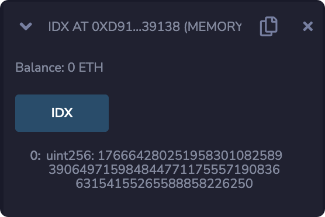
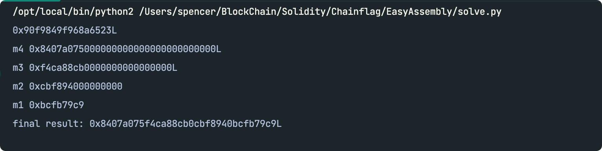

# EasyAssembly

## 源代码

```solidity
pragma solidity ^0.5.10;

contract EasyAssembly {
    event SendFlag(address addr);

    uint randomNumber = 0;
    bytes32 private constant ownerslot = keccak256('Welcome to qwb!!! You will find this so easy ~ Happy happy :D');

    bytes32[] public puzzle;
    uint count = 0;
    mapping(address=>bytes32) WinChecksum;

    constructor() public payable {
        setAddress(ownerslot, msg.sender);
    }

    modifier onlyWin(bytes memory code) {
        require(WinChecksum[msg.sender] != 0);
        bytes32 tmp = keccak256(abi.encodePacked(code));
        address target;
        assembly {
            let t1,t2,t3
            t1 := and(tmp, 0xffffffffffffffff)
            t2 := and(shr(0x40,tmp), 0xffffffffffffffff)
            t3 := and(shr(0x80,tmp), 0xffffffff)
            target := xor(mul(xor(mul(t3, 0x10000000000000000), t2), 0x10000000000000000), t1)
        }
        require(address(target)==msg.sender);
        _;
    }

    function setAddress(bytes32 _slot, address _address) internal {
        bytes32 s = _slot;
        assembly { sstore(s, _address) }
    }

    function deploy(bytes memory code) internal returns(address addr) {
        assembly {
            addr := create2(0, add(code, 0x20), mload(code), 0x1234)
            if eq(extcodesize(addr), 0) { revert(0, 0) }
        }
    }

    function gift() public payable {
        require(count == 0);
        count += 1;
        if(msg.value >= address(this).balance){
            emit SendFlag(msg.sender);
        }else{
            selfdestruct(msg.sender);
        }
    }

    function pass(uint idx, bytes memory bytecode) public {
        address addr = deploy(bytecode);
        bytes32 cs = tag(bytecode);
        bytes32 tmp = keccak256(abi.encodePacked(uint(1)));
        uint32 v;
        bool flag = false;

        assembly {
            let v1,v2
            v := sload(add(tmp, idx))
            if gt(v, sload(0)){
                v1 := and(add(and(v,0xffffffff), and(shr(0x20,v), 0xffffffff)), 0xffffffff)
                v2 := and(add(xor(and(shr(0x40,v), 0xffffffff), and(shr(0x60,v), 0xffffffff)), and(shr(0x80,v),0xffffffff)), 0xffffffff)
                if eq(xor(mul(v2,0x100000000), v1), cs){
                    flag := 1
                }
            }
        }
        if(flag){
            WinChecksum[addr] = cs;
        }else{
            WinChecksum[addr] = bytes32(0);
        }
    }

    function tag(bytes memory a) pure public returns(bytes32 cs) {
        assembly{
            let groupsize := 16
            let head := add(a,groupsize)
            let tail := add(head, mload(a))
            let t1 := 0x13145210
            let t2 := 0x80238023
            let m1,m2,m3,m4,s,tmp
            for { let i := head } lt(i, tail) { i := add(i, groupsize) } {
                s := 0x59129121
                tmp := mload(i)
                m1 := and(tmp,0xffffffff)
                m2 := and(shr(0x20,tmp),0xffffffff)
                m3 := and(shr(0x40,tmp),0xffffffff)
                m4 := and(shr(0x60,tmp),0xffffffff)
                for { let j := 0 } lt(j, 0x4) { j := add(j, 1) } {
                    s := and(mul(s, 2),0xffffffff)
                    t2 := and(add(t1, xor(sub(mul(t1, 0x10), m1),xor(add(t1, s),add(div(t1,0x20), m2)))), 0xffffffff)
                    t1 := and(add(t2, xor(add(mul(t2, 0x10), m3),xor(add(t2, s),sub(div(t2,0x20), m4)))), 0xffffffff)
                }
            }
            cs := xor(mul(t1,0x100000000),t2)
        }
    }

    function payforflag(bytes memory code) public onlyWin(code) {
        emit SendFlag(msg.sender);
        selfdestruct(msg.sender);
    }
}
```

## 思路

想要拿到flag，我们需要调用```payforflag()```函数，所以重点应该放在```onlyWin```这个修饰器上。

```onlylWin```的验证主要分为两部分，第一部分是```require(WinChecksum[msg.sender] != 0);```，第二部分是将传进去的```code```经过一系列运算后得到一个```target```，这个```target```需要与```msg.sender```相等。先看第一部分，```WinChecksum```的值只有```在pass()```函数中被修改了：

```solidity
function pass(uint idx, bytes memory bytecode) public {
        address addr = deploy(bytecode);
        bytes32 cs = tag(bytecode);
        bytes32 tmp = keccak256(abi.encodePacked(uint(1)));
        uint32 v;
        bool flag = false;

        assembly {
            let v1,v2
            v := sload(add(tmp, idx)) // v是owner的地址
            if gt(v, sload(0)){
                v1 := and(add(and(v,0xffffffff), and(shr(0x20,v), 0xffffffff)), 0xffffffff) //v1=0x00000000000000000000000000000000000000000000000000000000af2d7800
                v2 := and(add(xor(and(shr(0x40,v), 0xffffffff), and(shr(0x60,v), 0xffffffff)), and(shr(0x80,v),0xffffffff)), 0xffffffff) //v2=0x00000000000000000000000000000000000000000000000000000000e380e00f
                if eq(xor(mul(v2,0x100000000), v1), cs){//xor(mul(v2,0x100000000), v1) = 0x0000000000000000000000000000000000000000000000008e21268d44aa44ea
                    flag := 1
                }
            }
        }
        if(flag){
            WinChecksum[addr] = cs;
        }else{
            WinChecksum[addr] = bytes32(0);
        }
    }
```

首先是部署了字节码，然后将字节码经过```tag()```函数计算后得到```cs```，最后需要```cs```与```tmp```的值相等才能判定成功。

```tag()```函数乍一看比较复杂，其实大可以不必关系其中细节，因为给定了一个输入，其输出是固定的。而作为输入的字节码也是我们可以控制的，所以没必要细究。

但是在```gt(v, sload(0))```需要```v```的值大于```slot0```的值，分析代码可以看到这个合约除了在```setAddress()```函数中定义的```owner```的```address```不是为0，其余的```slot```都是0。所以我们只剩下一个选择，需要控制```idx```的值，使其经过一系列运算后得出```owner address```的```slot```。

可以简单用这个合约算一下：

```solidity
contract IDX{
  uint256 public IDX = uint256(keccak256('Welcome to qwb!!! You will find this so easy ~ Happy happy :D')) - uint256(keccak256(abi.encodePacked(uint(1))));
}
```



所以```idx```的值应该是```17666428025195830108258939064971598484477117555719083663154155265588858226250```。

现在看一下```tag()```函数的具体逻辑：

```solidity
assembly{
            let groupsize := 16
            let head := add(a,groupsize)
            let tail := add(head, mload(a))
            let t1 := 0x13145210
            let t2 := 0x80238023
            let m1,m2,m3,m4,s,tmp
            for { let i := head } lt(i, tail) { i := add(i, groupsize) } {
                s := 0x59129121
                tmp := mload(i)
                m1 := and(tmp,0xffffffff)
                m2 := and(shr(0x20,tmp),0xffffffff)
                m3 := and(shr(0x40,tmp),0xffffffff)
                m4 := and(shr(0x60,tmp),0xffffffff)
                for { let j := 0 } lt(j, 0x4) { j := add(j, 1) } {
                    s := and(mul(s, 2),0xffffffff)
                    t2 := and(add(t1, xor(sub(mul(t1, 0x10), m1),xor(add(t1, s),add(div(t1,0x20), m2)))), 0xffffffff)
                    t1 := and(add(t2, xor(add(mul(t2, 0x10), m3),xor(add(t2, s),sub(div(t2,0x20), m4)))), 0xffffffff)
                }
            }
            cs := xor(mul(t1,0x100000000),t2)
        }
```

这段内联汇编的逻辑大概是将```bytecode```以16个十六进制位分成一组，再对每组内4个十六进制位分别做运算。

```t2 := and(add(t1, xor(sub(mul(t1, 0x10), m1),xor(add(t1, s),add(div(t1,0x20), m2)))), 0xffffffff)```这段比较复杂，但是没关系，重点关注一下最后```cs```的计算方式```cs := xor(mul(t1,0x100000000),t2)```, 可以发现```mul(t1,0x100000000)```将```t1```拓展了8位，后续的```xor```操作则将```t2```附加到了```t1```后面, 所以我们可以使用```tag```函数先计算原本字节码的```cs```，然后根据```cs```可以还原出```t1```和```t2```的值，然后在通过padding的方式在原本的字节码后面添加字符，也就是最终的```t1```的```t2```是可以人为控制的，那最后的计算结果也是可以被控制的。

知道原理后可以用z3求解：

```python3
from z3 import *


def find(last, target):
    t1, t2 = int(last[:8], 16), int(last[8:], 16)
    tar1, tar2 = int(target[:8], 16), int(target[8:], 16)

    s = 0x59129121
    s = BitVecVal(s, 256)
    m1 = BitVec('m1', 256)
    m2 = BitVec('m2', 256)
    m3 = BitVec('m3', 256)
    m4 = BitVec('m4', 256)

    for j in range(4):
        s = (s + s) & 0xffffffff
        p1 = (t1 << 2) - m1
        p2 = t1 + s
        p3 = (t1 >> 5) + m2
        t2 = (t1 + (p1 ^ (p2 ^ p3))) & 0xffffffff
        p1 = (t2 << 4) + m3
        p2 = t2 + s
        p3 = (t2 >> 5) - m4
        t1 = (t2 + (p1 ^ (p2 ^ p3))) & 0xffffffff

    sol = Solver()
    sol.add(And(t1 == tar1, t2 == tar2))
    if sol.check():
        m = sol.model()
        m_l = map(lambda x: m[x].as_long(), [m4, m3, m2, m1])
        m4 = m_l[0] << 0x60
        m3 = m_l[1] << 0x40
        m2 = m_l[2] << 0x20
        m1 = m_l[3] << 0x00
        print "m4", hex(m4)
        print "m3", hex(m3)
        print "m2", hex(m2)
        print "m1", hex(m1)
        print "final result:", hex(m4 | m3 | m2 | m1)
    else:
        raise Exception('No solution')


def cal_target(address):
    a = address & 0xffffffff
    b = address >> 0x20 & 0xffffffff
    c = address >> 0x40 & 0xffffffff
    d = address >> 0x60 & 0xffffffff
    e = address >> 0x80 & 0xffffffff
    v1 = (a + b) & 0xffffffff
    v2 = ((c ^ d) + e) & 0xffffffff
    target = v2 << 0x20 | v1
    print hex(target)
    return hex(target)


address = 0x00000000000000000000000005B38Da6a701c568545dCfcB03FcB875f56beddC4
last = "19c1c82343bff459"
target = cal_target(address)[2:-1]
find(last, target)
```


